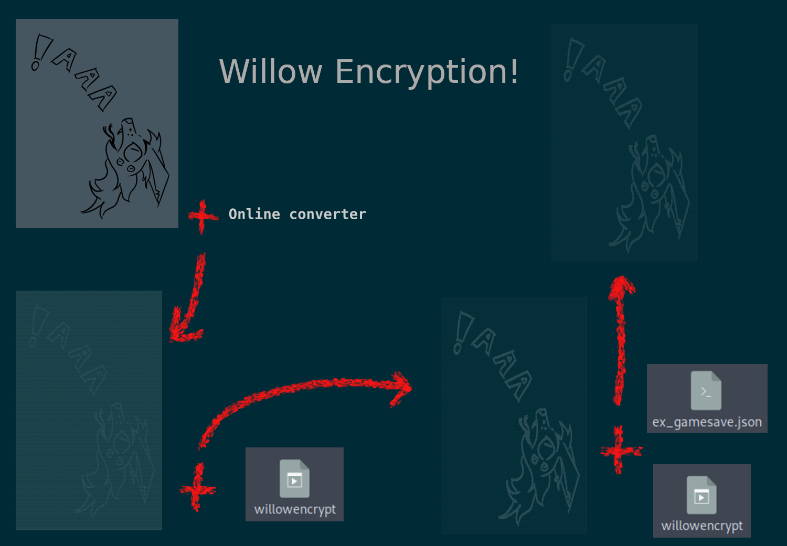

# Willow Encryption

Welcome to the Willow encryption algorithm!
Want to take a boring old json file and turn it into a lovely ascii picture that's cuss near impossible to read?
Want to then extract an entire json from that image?
Well then mate, keep reading!

## DISCLAIMER

DO NOT actually trust the strength of this encryption. I'm not a security expert. I'm not a pentester.
This program was made for a one off joke, and was never intented to be used for serious applications.

I take no responsibility for files getting cracked, or files failing to decrypt into their exact original states.
Certainly don't forget the key you used to encrypt. Unless you find a flaw in the encryption process (I can think of a few), I haven't written a way to get that data back.

But certainly, certainly above all else, HAVE FUN!

## Building

### On Linux:

cd [build location]

cmake -S [path to this directory] -B .

make

### On Windows:

cd [build location]

cmake -S [path to this directory] -B .

compile using your IDE of choice

### On Mac:

I can't even tell you how to find the file explorer on Mac.

I assume "cmake -S [path to this directory] -B ." still works

compile using your IDE of choice?

### Building without cmake

The program is only 2 files, a main.cpp and a manual.hpp. As long as you know how to link the nlohmann json library, you could just use the g++ compiler to compile this code.

## Installation

DON'T TRY AND INSTALL THIS. Add it the command to path if you really like it for some reason.

## Usage

willowencrypt -f "@" -o [output] -e [json file to encrypt] [ascii art] [key] # Creates an encrypted file in the shape of the art by replacing all the '@'s with data

willowencrypt -o [output] -d [encrypted file] [key] # Decrypts a file back into a json file

willowencrypt -f "@" -r "." -o [output] -m [char to not change] [improper ascii art] # Will turn an image into 'monochrome' (made up of only 2 chars), and is the best case scenario for the algorithm.

willowencrypt -h # Will tell you much more

## What's in here?

### ex_gamesave.json

An unencrypted json file, like what might be used as a game save file.

### ex_rawArt_#.png

An image drawn by me that can be put through an online ascii art converter.

Feel free to use this image however you like.

### ex_genAscii_#.txt

An ascii image, like what might be generated from an online image to ascii converter.
This file is NOT in the best case scenario to used as a template. (Although is possible)

### ex_ascii_#.txt

An ascii template thats been put through "-m", and is ready to be used as a template.

### ex_encrypted_#.lvbn

A file generated containing the json data, using the ascii template, with the key set to "pinetree".

### ex_decrypted_#.json

The json files that were extracted from the image using the key "pinetree"

## Requirements

C++11 or later

Cmake 3.18.4 or later

## Contributing

Pull requests are welcome. Major changes are also welcome. I will make an attempt to keep up with issue reports and suggestions, but again, this whole thing was a joke.

This is my first commit, and my first time using cmake. If you have any suggestions on how to improve this, I'll gladly try to update it.

## Comments or Questions?

Got any questions for building, running, or modding? Comments on how I can improve? Let me know on Twitter [@BizarreMac](https://twitter.com/BizarreMac)

## Acknowledgment

Thanks to [CyanSorcery](https://twitter.com/cyansorcery) for the inspiration for this.
For without her thinking out loud about if she should encrypt the save files for her game, I would have never wanted to go on an alcohol fueled rampage of making a file in the shape of a fox face.

Thanks to [SushiClaws](https://twitter.com/SUSHiCLAWS) for letting me use its art to show off what this program can do at large scales. (None of its art is included in this source for ownership reasons)

## License
[MIT](https://choosealicense.com/licenses/mit/)
